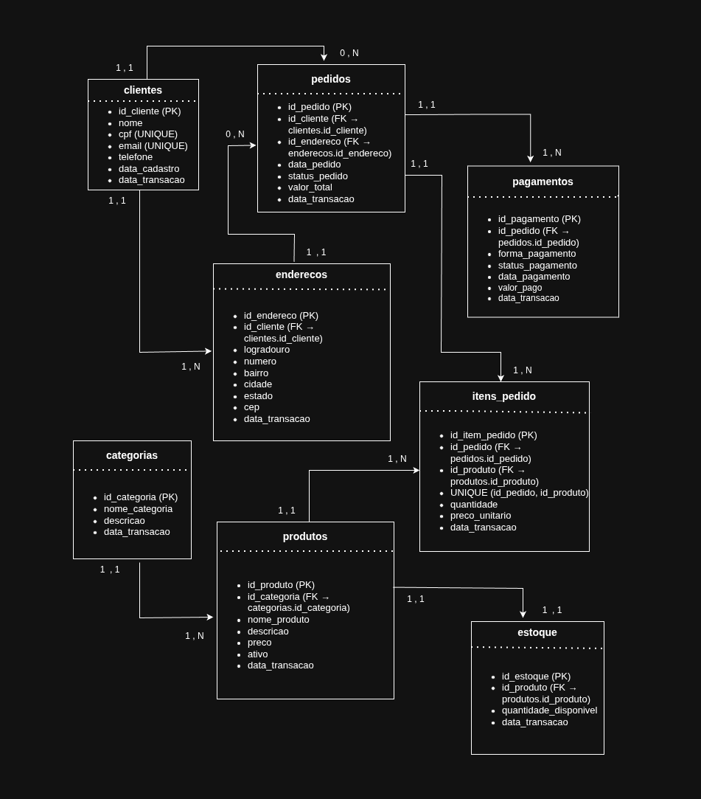

# Python Ecommerce Simulator

Simulador transacional de ecommerce desenvolvido em Python para geração contínua de dados operacionais em MySQL.

O projeto foi criado para simular um ambiente real de ecommerce, reproduzindo operações de negócio como:

* criação de pedidos
* pagamentos
* movimentação de estoque
* reabastecimento automático
* atualização de status transacionais

Os dados gerados servem como origem operacional para pipelines de Data Engineering e análises analíticas.

---

# Arquitetura do Projeto

O simulador foi estruturado em componentes separados, cada um responsável por uma parte específica do fluxo operacional.

| Componente           | Responsabilidade                                  |
| -------------------- | ------------------------------------------------- |
| `run.py`             | Entry point da aplicação                          |
| `scheduler.py`       | Controle temporal da simulação                    |
| `order_flow.py`      | Fluxo transacional de pedidos                     |
| `restock.py`         | Reposição automática de estoque                   |
| `data_generators.py` | Regras probabilísticas e geração de comportamento |
| `db.py`              | Gerenciamento de conexão com MySQL                |

---

# Fluxo Operacional

O simulador executa continuamente um fluxo transacional semelhante a um ecommerce real:

```text
Cliente → Pedido → Itens → Pagamento → Atualização de Status → Estoque → Reposição
```

Cada pedido:

1. seleciona um cliente aleatório
2. seleciona um endereço pertencente ao cliente
3. escolhe produtos com estoque disponível
4. cria os itens do pedido
5. registra pagamento
6. atualiza o status final
7. realiza commit transacional

A cada múltiplos pedidos executados, o sistema verifica automaticamente a necessidade de reabastecimento de estoque.

---

# Características Técnicas

## Transações ACID

O projeto utiliza transações explícitas com:

```python
conn.commit()
conn.rollback()
```

Garantindo consistência operacional durante:

* criação de pedidos
* inserção de itens
* atualização de estoque
* processamento de pagamentos

---

## Simulação Probabilística

O sistema implementa distribuições probabilísticas para reproduzir comportamento operacional mais realista.

### Formas de pagamento

| Forma             | Probabilidade |
| ----------------- | ------------- |
| PIX               | 50%           |
| Cartão de Crédito | 35%           |
| Boleto            | 15%           |

### Quantidade de itens por pedido

| Quantidade | Probabilidade |
| ---------- | ------------- |
| 1 item     | 45%           |
| 2 itens    | 25%           |
| 3 itens    | 15%           |
| 4 itens    | 10%           |
| 5 itens    | 5%            |

### Regras operacionais

* pagamentos via PIX e cartão possuem maior taxa de aprovação
* pedidos via boleto possuem maior chance de permanecer em processamento
* produtos só podem ser vendidos quando há estoque disponível

---

## Geração Contínua de Eventos

A simulação funciona continuamente utilizando controle de throughput:

```python
rodar_simulacao(pedidos_por_minuto=0.8)
```

Isso permite simular diferentes cargas operacionais:

| Cenário         | Pedidos por minuto |
| --------------- | ------------------ |
| Baixo volume    | 0.5                |
| Volume moderado | 5                  |
| Stress test     | 100+               |

---

# Modelo Relacional

O simulador utiliza um modelo relacional simplificado de ecommerce.

## Entidades principais

* clientes
* enderecos
* produtos
* estoque
* pedidos
* itens_pedido
* pagamentos

## Diagrama



---

# Estrutura do Projeto

```text
python-simulator-ecommerce/
├── docs/
│   └── images/
│       └── modelo_relacional.png
│
├── src/
│   ├── data_generators.py
│   ├── db.py
│   ├── order_flow.py
│   ├── restock.py
│   └── scheduler.py
│
├── run.py
├── requirements.txt
└── README.md
```

---

# Tecnologias Utilizadas

* Python
* MySQL
* mysql-connector-python
* SQL

---

# Execução do Projeto

## 1. Clonar repositório

```bash
git clone https://github.com/danielvianna65-ai/python-simulator-ecommerce.git
cd python-simulator-ecommerce
```

---

## 2. Criar ambiente virtual

```bash
python -m venv .venv
source .venv/bin/activate
```

---

## 3. Instalar dependências

```bash
pip install -r requirements.txt
```

---

## 4. Configurar banco MySQL

Criar banco:

```sql
CREATE DATABASE ecommerce;
```

Ajustar credenciais no arquivo:

```text
src/db.py
```

---

## 5. Executar simulador

```bash
python run.py
```

---

# Casos de Uso

O simulador pode ser utilizado para:

* testes de pipelines de dados
* geração de massa transacional
* validação de cargas incrementais
* estudos de modelagem dimensional
* simulação operacional de ecommerce
* desenvolvimento de pipelines Spark/Airflow
* testes de ingestão 

---

# Integração com Engenharia de Dados

O projeto foi desenvolvido para servir como origem operacional de pipelines analíticos.

Os dados gerados podem alimentar:

* pipelines Medallion
* camadas Landing / Raw / Trusted / Refined
* processos incrementais
* cargas Spark
* pipelines orquestrados com Airflow
* data lakes
* modelos dimensionais

---

# Melhorias Futuras

* geração temporal avançada
* múltiplos workers concorrentes
* simulação de Black Friday
* eventos de cancelamento
* integração com Kafka

---

# Objetivo do Projeto

O objetivo do projeto é simular um sistema operacional simplificado de ecommerce capaz de gerar dados transacionais contínuos e coerentes para estudos de Engenharia de Dados, pipelines analíticos e modelagem de dados.
